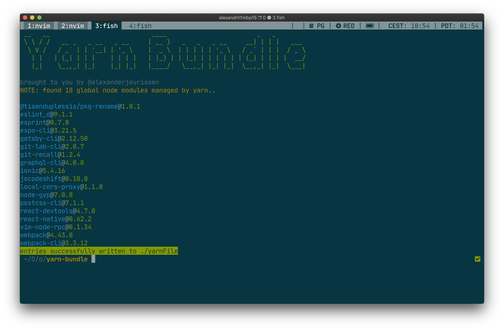
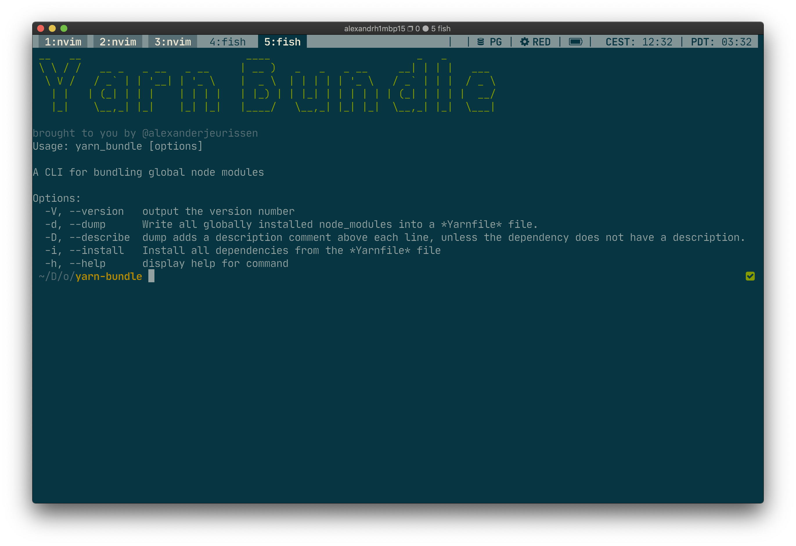

# yarn-bundle 📦

Bundler for global yarn packages.
Heavily inspired by [HomeBrew bundle](https://github.com/Homebrew/homebrew-bundle).



### Options

*yarn-bundle* comes with a `--help` command to list all the CLI options that can be passed.
The options that *yarn-bundle* accepts are very similar to *homebrew-bundle*



```conf
Usage: yarn_bundle [options]

A CLI for bundling global node modules

Options:
  -V, --version   output the version number
  -d, --dump      Write all globally installed node_modules into a *yarnFile* file.
  -D, --describe  dump adds a description comment above each line, unless the dependency does not have a description.
  -i, --install   WIP: Install all dependencies from the *yarnFile* file
  -f, --file      WIP: Read the *yarnFile* file from this location.
  -h, --help      display help for command
```

### Examples

Several example *yarnFile* can be found in the public/assets folder:

- [yarnFile](public/assets/example_yarn_file) without descriptions (default)
- [yarnFile](public/assets/example_yarn_file_with_describe) with descriptions (using --describe option)
